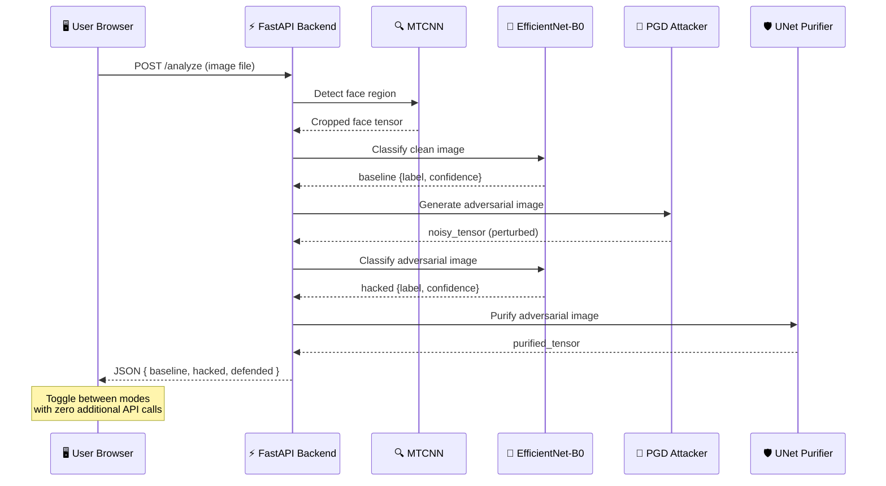

<div align="center">


<br/><br/>

```
███████╗███████╗███╗   ██╗████████╗██╗███╗   ██╗ █████╗ ██╗      ██████╗ ███████╗
██╔════╝██╔════╝████╗  ██║╚══██╔══╝██║████╗  ██║██╔══██╗██║     ██╔═══██╗██╔════╝
███████╗█████╗  ██╔██╗ ██║   ██║   ██║██╔██╗ ██║███████║██║     ██║   ██║███████╗
╚════██║██╔══╝  ██║╚██╗██║   ██║   ██║██║╚██╗██║██╔══██║██║     ██║   ██║╚════██║
███████║███████╗██║ ╚████║   ██║   ██║██║ ╚████║██║  ██║███████╗╚██████╔╝███████║
╚══════╝╚══════╝╚═╝  ╚═══╝   ╚═╝   ╚═╝╚═╝  ╚═══╝╚═╝  ╚═╝╚══════╝ ╚═════╝ ╚══════╝
                                                           
```

### **Neural Threat Purification Framework**
*An end-to-end adversarial machine learning system that simulates real-world AI attacks and neutralizes them in real time*

<br/>

[](https://sentinal-os-eosin.vercel.app/)
[](https://huggingface.co/spaces/emadhav/Sentinal-API)
[](https://github.com/e-madhav/Sentinal.os)

</div>

---

## 📌 Table of Contents

- [Overview](#-overview)
- [Live Demo](#-live-demo)
- [Architecture](#-architecture)
- [Pipeline Deep Dive](#-pipeline-deep-dive)
- [Tech Stack](#-tech-stack)
- [Model Details](#-model-details)
- [Project Structure](#-project-structure)
- [Local Setup](#-local-setup)
- [Deployment](#-deployment)
- [Results & Observations](#-results--observations)
- [Author](#-author)

---

## 🧠 Overview

**SENTINAL.OS** is a full-stack adversarial machine learning demonstration platform that exposes the fragility of deep learning classifiers under pixel-level attacks — and showcases how a trained neural purifier can defend against them.

The system operates on a **3-stage pipeline** applied to facial images:

| Stage | Component | Role |
|-------|-----------|------|
| 🔍 **Detect** | MTCNN | Locates and crops the face from any input image |
| 🧠 **Classify** | EfficientNet-B0 | Predicts: `REAL HUMAN` or `DEEPFAKE` |
| 👾 **Attack** | PGD (Projected Gradient Descent) | Injects imperceptible adversarial noise to fool the classifier |
| 🛡️ **Purify** | UNet + ResNet18 Encoder | Strips the adversarial signal, restoring correct classification |

> **Key insight:** The adversarial perturbations are invisible to the human eye (bounded at ε = 8/255 pixel intensity) yet cause the classifier to misidentify subjects with high confidence — demonstrating a critical vulnerability in real-world AI systems.

---

## 🌐 Live Demo

| Resource | Link |
|----------|------|
| **Frontend (Vercel)** | [https://sentinal-os-eosin.vercel.app/](https://sentinal-os-eosin.vercel.app/) |
| **Backend API (HuggingFace Spaces)** | [https://huggingface.co/spaces/emadhav/Sentinal-API](https://huggingface.co/spaces/emadhav/Sentinal-API) |
| **Source Code** | [https://github.com/e-madhav/Sentinal.os](https://github.com/e-madhav/Sentinal.os) |

The frontend is a zero-dependency HTML/CSS/JS application served via Vercel CDN. The backend is a FastAPI server hosted on a HuggingFace Space with GPU inference.

---

## 🏗️ Architecture

### System Architecture

```
┌─────────────────────────────────────────────────────────────────────┐
│                        SENTINAL.OS SYSTEM                           │
├──────────────────────┬──────────────────────────────────────────────┤
│                      │                                              │
│   FRONTEND           │   BACKEND  (FastAPI · HuggingFace Spaces)   │
│   (Vercel CDN)       │                                              │
│                      │   ┌──────────┐     ┌──────────────────────┐ │
│  ┌────────────────┐  │   │          │     │                      │ │
│  │  index.html    │  │   │  MTCNN   │────▶│  EfficientNet-B0     │ │
│  │                │  │   │ (face    │     │  (binary classifier) │ │
│  │  Upload Image  │──┼──▶│  detect) │     │  REAL / DEEPFAKE     │ │
│  │  Mode Toggle   │  │   │          │     │                      │ │
│  │  Dual Monitor  │  │   └──────────┘     └──────────────────────┘ │
│  │  Display       │  │        │                      │             │
│  └────────────────┘  │        │            ┌─────────▼──────────┐  │
│         ▲            │        │            │   PGD Attacker     │  │
│         │            │        │            │   ε = 8/255        │  │
│    JSON Response     │        │            │   α = 2/255        │  │
│    (3 images +       │        │            │   steps = 10       │  │
│     predictions)     │        │            └─────────┬──────────┘  │
│                      │        │                      │             │
│                      │        │            ┌─────────▼──────────┐  │
│                      │        │            │   UNet Purifier    │  │
│                      │        │            │   ResNet18 encoder │  │
│                      │        │            │   Denoising model  │  │
│                      │        │            └────────────────────┘  │
└──────────────────────┴──────────────────────────────────────────────┘
```

### Request / Response Flow



---

## 🔬 Pipeline Deep Dive

### Stage 1 — Face Detection (MTCNN)

The system uses `facenet-pytorch`'s Multi-Task Cascaded Convolutional Network (MTCNN) to:
- Detect bounding boxes of faces in the uploaded image
- Select the largest/most prominent face
- Crop and pass it to the downstream pipeline

This ensures the classifier and attacker operate on a clean, standardized 224×224 facial region rather than raw scene images.

### Stage 2 — Baseline Classification (EfficientNet-B0)

```
Input: 224×224 RGB tensor
Normalization: μ=[0.485, 0.456, 0.406], σ=[0.229, 0.224, 0.225]
Architecture: EfficientNet-B0 (pretrained backbone, 2-class head)
Output: P(REAL), P(DEEPFAKE) via softmax
```

The classifier was fine-tuned on a curated face dataset (real vs. deepfake) and achieves high accuracy on clean inputs.

### Stage 3 — Adversarial Attack (PGD)

**Projected Gradient Descent** is a white-box iterative attack. At each step it:
1. Computes the gradient of the loss w.r.t. the input image
2. Takes a small step in the direction that **increases** classification error
3. Projects back into the ε-ball to keep perturbations imperceptible

```
Parameters:
  ε  = 8/255    (max perturbation per pixel)
  α  = 2/255    (step size)
  k  = 10 steps (iterations)
```

The resulting image looks identical to humans but causes the neural network to flip its prediction.

### Stage 4 — Adversarial Purification (UNet)

```
Architecture : UNet with ResNet18 encoder (segmentation_models_pytorch)
Input        : Adversarially perturbed 3-channel image tensor
Output       : Denoised 3-channel image tensor
Task         : Learn the mapping: adversarial → clean
```

The purifier was trained to recognize and remove the high-frequency adversarial noise patterns, restoring the image to a distribution the classifier was originally trained on.

---

## 🛠️ Tech Stack

### Backend

| Component | Technology |
|-----------|-----------|
| **Web Framework** | FastAPI + Uvicorn |
| **Deep Learning** | PyTorch |
| **Classifier** | `torchvision` — EfficientNet-B0 |
| **Purifier** | `segmentation_models_pytorch` — UNet/ResNet18 |
| **Attack** | `torchattacks` — PGD |
| **Face Detection** | `facenet-pytorch` — MTCNN |
| **Image Processing** | Pillow, NumPy |
| **API Hosting** | HuggingFace Spaces (ZeroGPU / CPU) |

### Frontend

| Component | Technology |
|-----------|-----------|
| **Framework** | Vanilla HTML5 / CSS3 / JavaScript (zero dependencies) |
| **Fonts** | Orbitron, Share Tech Mono, Rajdhani (Google Fonts) |
| **Animations** | CSS keyframe animations, Canvas 2D particle system |
| **Hosting** | Vercel (static CDN) |
| **API Communication** | Native `fetch()` with FormData |

---

## 📁 Project Structure

```
Sentinal.os/
│
├── main.py                  # FastAPI backend — all inference logic
├── index.html               # Frontend — single-file app
│
├── base_classifier.pth      # Fine-tuned EfficientNet-B0 weights
├── unet_purifier.pth        # Trained UNet denoiser weights
│
└── README.md
```

The entire backend is contained in a single `main.py` for simplicity, with all four ML components (MTCNN, classifier, attacker, purifier) loaded once at startup and reused across requests.

---

## 🚀 Local Setup

### Prerequisites

```bash
Python 3.9+
pip
```

### Installation

```bash
# 1. Clone the repository
git clone https://github.com/e-madhav/Sentinal.os.git
cd Sentinal.os

# 2. Install dependencies
pip install fastapi uvicorn torch torchvision \
            segmentation-models-pytorch torchattacks \
            facenet-pytorch pillow numpy python-multipart

# 3. Make sure model weights are present
#    base_classifier.pth  ← EfficientNet-B0 weights
#    unet_purifier.pth    ← UNet purifier weights

# 4. Run the server
uvicorn main:app --reload --host 0.0.0.0 --port 8000
```

### Accessing the UI

```
http://localhost:8000
```

The server serves `index.html` directly at the root endpoint. No separate frontend build step is needed.

> **Note:** In `index.html`, ensure `const API_URL = "/analyze"` is uncommented (local mode). For production cloud, switch to the HuggingFace Spaces URL.

---

## ☁️ Deployment

### Backend → HuggingFace Spaces

The FastAPI backend is deployed as a HuggingFace Space using the **Gradio SDK (Docker)** runner:

1. Upload `main.py`, `base_classifier.pth`, `unet_purifier.pth` to the Space
2. Add a `requirements.txt` with all pip dependencies
3. HuggingFace auto-builds and serves the FastAPI app

**Live API:** [https://huggingface.co/spaces/emadhav/Sentinal-API](https://huggingface.co/spaces/emadhav/Sentinal-API)

### Frontend → Vercel

The frontend is a single `index.html` — deployed by dragging the folder to Vercel or via the Vercel CLI:

```bash
# Switch API URL in index.html to HuggingFace Spaces endpoint
# const API_URL = "https://emadhav-sentinal-api.hf.space/analyze";

npx vercel --prod
```

**Live Frontend:** [https://sentinal-os-eosin.vercel.app/](https://sentinal-os-eosin.vercel.app/)

---

## 📊 Results & Observations

### Attack Effectiveness

The PGD attack (ε = 8/255, 10 steps) consistently causes the EfficientNet-B0 classifier to:
- **Flip its prediction** (REAL → DEEPFAKE or vice versa) in the majority of test cases
- Report **high confidence** in the incorrect prediction (often > 90%)
- Produce perturbations that are **visually imperceptible** to human observers

### Purification Effectiveness

The trained UNet purifier:
- Successfully **removes adversarial noise** from perturbed images
- Restores classification accuracy to levels **near the clean baseline**
- Operates in a **single forward pass** — adding minimal latency to the pipeline

### Key Takeaway

> This project demonstrates that even state-of-the-art deep learning classifiers are brittle under structured adversarial attacks, and that **input purification** is a viable defense strategy — particularly when the purifier is trained specifically to counter the attack distribution it will face in deployment.

---

## 💡 What I Built & Learned

- **End-to-end ML system design** — from raw image input to multi-model inference pipeline with a live web interface
- **Adversarial ML fundamentals** — implementing and understanding white-box attacks (PGD) and defense strategies (adversarial purification)
- **Full-stack deployment** — decoupled frontend (Vercel) + backend (HuggingFace Spaces) with CORS and REST API design
- **Production API patterns** — model loading at startup, async request handling, base64 image serialization, error handling

---

## 👤 Author

**Madhav Emineni**

[](https://github.com/e-madhav)
[](https://huggingface.co/emadhav)

---

<div align="center">

**Built with PyTorch · FastAPI · HuggingFace · Vercel**

*If this project was useful or interesting, please consider starring ⭐ the repository.*

</div>
